<div align="center">



<br/>

<a href="https://linkedin.com/in/nirvan-m-4a44802ab"></a>
<a href="mailto:nirvanm67@gmail.com"></a>

</div>

<br/>

## `01` · About

I turn data into insight, and insight into intelligent systems.

I'm a third-year **Information Science & Engineering** student at **AIEMS, Bengaluru**, working across **AI, computer vision and automation** — from detection systems on industrial camera feeds to workflow automation and operational analytics. I like connecting models to the software around them: the camera, the database, the dashboard someone actually checks.

Right now I'm interning at **Saatvik Solutions**, building AI-integrated software systems.

```text
LEARN → BUILD → EXPERIMENT → DEPLOY → ITERATE

Python / Data → Machine Learning → Computer Vision → Industrial AI → Automation → AI + Software Systems
```

**Currently building**

- 🏭 **Industrial computer vision** — high-speed detection, counting and visual inspection
- 🧠 **AI-powered applications** — intelligent systems paired with practical software
- 🔄 **Data & automation** — analytics and workflow automation pipelines

<br/>

## `02` · How I build

<div align="center">

</div>

<br/>

## `03` · Tech stack

<div align="center">

</div>

<br/>

## `04` · Projects

<table>
  <tr>
    <td width="50%" valign="top">
      <h3>🧠 ShadowMind</h3>
      <sub><b>AI-driven human intelligence system</b> · experimental</sub><br/><br/>
      Voice in, insight out — speech is transcribed with Whisper, run through emotional-tone and behavioural-pattern analysis, and surfaced on a live dashboard.<br/><br/>
      <code>Python</code> <code>Whisper</code> <code>Hugging Face</code> <code>FastAPI</code> <code>WebSockets</code> <code>Electron</code>
    </td>
    <td width="50%" valign="top">
      <h3>🔩 VAIL</h3>
      <sub><b>High-speed screw counting system</b></sub><br/><br/>
      Industrial computer vision for a fast conveyor line — a hybrid detector plus a geometric identifier, reconciled across frames to keep counts accurate at production speed.<br/><br/>
      <code>Python</code> <code>OpenCV</code> <code>Computer Vision</code>
    </td>
  </tr>
  <tr>
    <td width="50%" valign="top">
      <h3>🏭 Industrial Pallet &amp; Case Detection</h3>
      <sub><b>Multi-camera detection with live monitoring</b></sub><br/><br/>
      YOLO detection with zone-based counting, streamed to a desktop dashboard for warehouse and line monitoring.<br/><br/>
      <code>YOLOv8</code> <code>OpenCV</code> <code>WebSockets</code> <code>Electron</code> <code>Node.js</code> <code>MongoDB</code>
    </td>
    <td width="50%" valign="top">
      <h3>🚌 BlueFleet</h3>
      <sub><b>BMTC operations dashboard</b></sub><br/><br/>
      A Power BI dashboard that brings route, performance and efficiency data into one operational view, built with DAX measures.<br/><br/>
      <code>Power BI</code> <code>DAX</code> <code>Python</code>
    </td>
  </tr>
  <tr>
    <td width="50%" valign="top">
      <h3>🗣️ Hear The Unheard</h3>
      <sub><b>NLP + text-to-speech pipeline</b></sub><br/><br/>
      Turns typed or simplified input into natural spoken output, aimed at easing everyday communication.<br/><br/>
      <code>NLP</code> <code>Python</code> <code>Text-to-Speech</code> <code>AI APIs</code>
    </td>
    <td width="50%" valign="top">
      <h3>🤖 LUCIFER</h3>
      <sub><b>Agentic AI assistant</b></sub><br/><br/>
      Multi-API integration and n8n workflows that interpret natural-language commands and orchestrate multi-step tasks.<br/><br/>
      <code>Agentic AI</code> <code>NLP</code> <code>n8n</code> <code>APIs</code>
    </td>
  </tr>
</table>

<br/>

## `05` · Experience & recognition

| When | Role | Where |
| :-- | :-- | :-- |
| Mar 2026 – Present | Software Development Intern | Saatvik Solutions |
| Jan 2025 – Mar 2025 | Artificial Intelligence Intern | Edunet · Microsoft AICTE |
| 2025 – Present | Director of International Service | Rotaract Club |

- 🏆 **Core Organiser** — Nexora 2026, national-level hackathon at AIEMS
- 🎤 **College Representative** — IEEE NexGen Summit 2025, RNSIT Bengaluru
- 🥇 **Top 5 Finalist** — Algo Olympics 2025, JNNCE Tech Fest
- 📜 **Certifications** — ISRO (AI/ML for Geodata Analysis) · Accenture (Data Analytics & Visualization) · AWS (Software Architecture) · TCS (iON Career Edge)

<br/>

## `06` · Contribution graph, in 3D

<div align="center">

</div>

<br/>

<div align="center">

</div>
